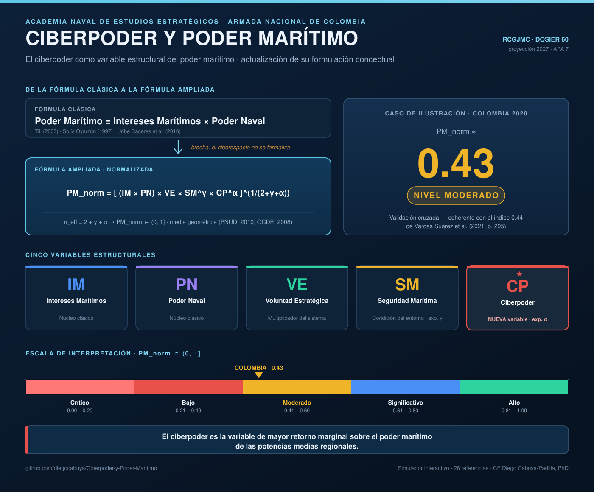

# Ciberpoder y Poder Marítimo

**El ciberpoder como variable estructural del poder marítimo: una actualización de su formulación conceptual**

*Cyber power as a structural variable of sea power: a conceptual update of its formulation*

  
  &nbsp;
  

---

## Resumen

Este proyecto propone una **actualización analítico-conceptual** de la fórmula clásica del poder marítimo —tradicionalmente expresada como el producto de los **Intereses Marítimos (IM)** y el **Poder Naval (PN)**— para incorporar el **Ciberpoder (CP)** como variable estructural, junto con la **Voluntad Estratégica (VE)** y la **Seguridad Marítima (SM)**.

La propuesta se fundamenta en la tradición doctrinal que va de Mahan y Corbett a Till (2007), Solís Oyarzún (1997) y Uribe Cáceres et al. (2016), tiene alcance internacional y se **ilustra con Colombia** como caso de análisis, desde la perspectiva de una potencia media regional con desafíos multidominio.

## De la fórmula clásica a la fórmula ampliada

| | |
|---|---|
| **Clásica** | `Poder Marítimo = Intereses Marítimos × Poder Naval` |
| **Brecha** | El ciberespacio, como dominio operativo y estratégico, no queda formalizado. |
| **Ampliada** | `PM_norm = [ (IM × PN) × VE × SM^γ × CP^α ]^(1/(2+γ+α))` |

La normalización mediante `n_eff = 2 + γ + α` (metodología de media geométrica, PNUD, 2010; OCDE, 2008) garantiza que `PM_norm ∈ (0, 1]`, con interpretación directa en una escala analítica de cinco niveles.

## Las cinco variables estructurales

| Código | Variable | Rol en el modelo |
|--------|----------|------------------|
| **IM** | Intereses Marítimos | Núcleo clásico |
| **PN** | Poder Naval | Núcleo clásico |
| **VE** | Voluntad Estratégica | Multiplicador del sistema completo |
| **SM** | Seguridad Marítima | Condición del entorno (exponente **γ**) |
| **CP** | **Ciberpoder** | **Nueva variable estructural** (exponente **α**) |

## Escala de interpretación `PM_norm ∈ (0, 1]`

| Rango | Nivel | Descripción estratégica |
|-------|-------|-------------------------|
| 0.81 – 1.00 | **Alto** | Potencia marítima consolidada con proyección multidominio global |
| 0.61 – 0.80 | **Significativo** | Potencia marítima regional con capacidades multidominio desarrolladas |
| 0.41 – 0.60 | **Moderado** | Potencia marítima en desarrollo con brechas estratégicas identificables |
| 0.21 – 0.40 | **Bajo** | Capacidad marítima incipiente con vulnerabilidades estructurales dominantes |
| 0.00 – 0.20 | **Crítico** | Vulnerabilidad marítima estructural |

## Caso de ilustración: Colombia

La fórmula produce **PM_norm ≈ 0.43** (nivel **Moderado**), resultado coherente con el índice de 0.44 reportado por Vargas Suárez et al. (2021, p. 295) para 2020 —lo que constituye una **validación cruzada** del modelo—.

El hallazgo central: para las potencias medias regionales, el **ciberpoder es la variable de mayor retorno marginal** sobre el poder marítimo.

## Contenido del repositorio

- **[`Articulo_Ciberpoder_Poder_Maritimo.pdf`](Articulo_Ciberpoder_Poder_Maritimo.pdf)** — Artículo científico completo (formulación conceptual, desarrollo de la fórmula ampliada, caso colombiano y agenda de investigación).
- **[`simulador_PM_interactivo_v6.html`](simulador_PM_interactivo_v6.html)** — Simulador interactivo de la fórmula ampliada. Permite ajustar las cinco variables y los exponentes γ y α, comparar países de referencia y visualizar el resultado sobre la escala de interpretación. Se abre directamente en cualquier navegador o [**en vivo aquí**](https://diegocabuya.github.io/Ciberpoder-y-Poder-Maritimo/simulador_PM_interactivo_v6.html).
- **`esquema_proyecto.svg`** — Esquema visual del proyecto.

## Cita sugerida

> Cabuya-Padilla, D. E. (en preparación). *El ciberpoder como variable estructural del poder marítimo: una actualización de su formulación conceptual*. Revista Científica General José María Córdova (RCGJMC), Dosier 60.

## Autor

**CF Diego Edison Cabuya-Padilla, PhD** — Academia Naval de Estudios Estratégicos, Armada Nacional de Colombia.
